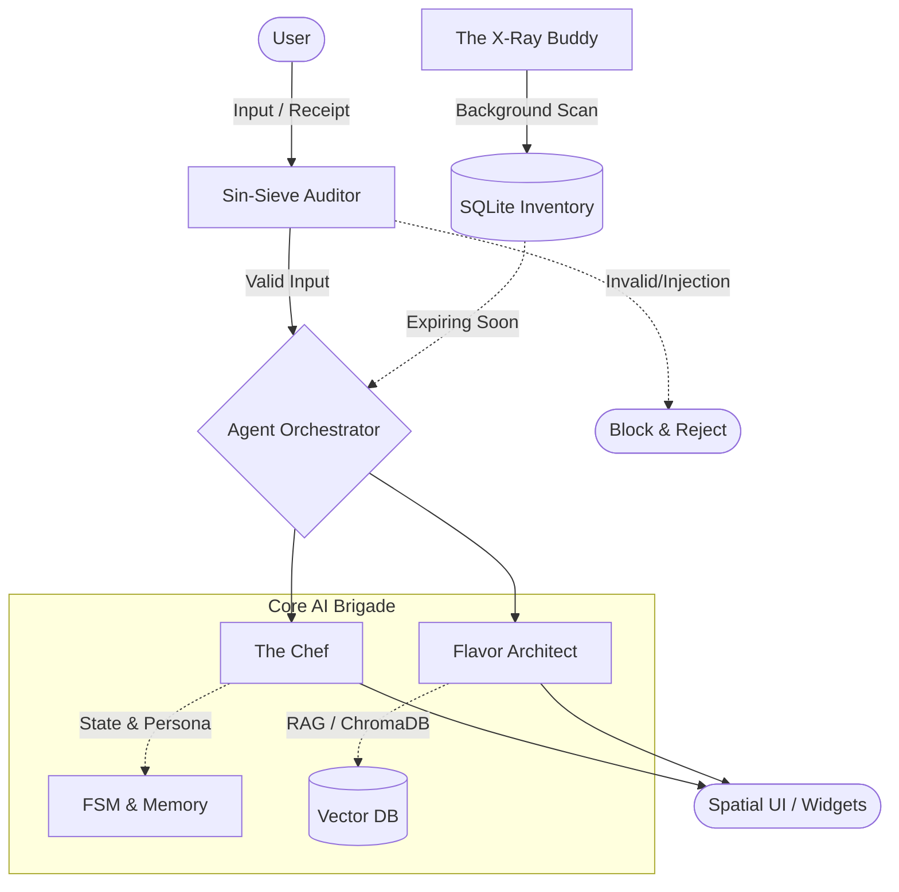

# KozakEye OS: Smart Kitchen AI 👁️🔪

**KozakEye OS** is more than just a recipe app. It is an autonomous operating system for your kitchen, driven by a specialized Multi-Agent AI Brigade. It analyzes your grocery receipts, understands your fridge inventory, remembers your personal preferences, and features its own—slightly grumpy but brilliant—digital Chef.

---

## 🧠 The KozakEye AI Brigade

Under the hood, a specialized team of AI agents is orchestrated by our custom engine. They don't just generate text—they debate, audit each other, and collaborate in real-time to craft the perfect culinary experience.



* 👨‍🍳 **The Chef (State & Persona Engine)**
  The heart of the kitchen. A philosophical, passionate, and slightly sarcastic Chef. He remembers your past meals (Long-Term Memory), adapts to your skill level, and manages the conversation via a strict Finite State Machine (FSM). He won't hand over a recipe until you prove you respect the ingredients.
* 🛡️ **Sin-Sieve Auditor (The Bouncer)**
  Security first. Before the Chef even hears your prompt, Sin-Sieve intercepts it. It ruthlessly blocks prompt injections, off-topic technical questions, and non-culinary nonsense. Try to "hack" the kitchen, and Sin-Sieve will simply throw you out.
* 🔬 **Flavor Architect (The Creator)**
  The generative engine. When the Chef finally approves a recipe generation, the Flavor Architect takes over. It queries the vector database (ChromaDB) to calculate the ingredient harmony index and outputs crisp, structured JSON recipes perfectly tailored to what is actually in your fridge.
* 👁️ **The X-Ray Buddy (Proactive Scanner)**
  Your invisible inventory sentinel. It constantly scans your digital fridge in the background. If the chicken expires tomorrow, the X-Ray Buddy proactively injects a warning straight into the Chef's Thought Trace, forcing him to pivot the conversation and save your groceries.

---

## ✨ Key Features

* **Spatial UI & Widget OS:** A 2.5D interface (Vue 3) with freely draggable widgets and intelligent density adaptation via CSS Container Queries.
* **Smart Receipt Scanner:** A hybrid physical receipt digitization pipeline powered by Gemini Vision (2.5-flash), with automatic parsing into the SQLite inventory.
* **Conversational Pivot & Thought Trace:** Experience the AI's transparent reasoning process directly in the UI. The Chef can halt generation to ask clarifying questions (Clarification Loop).
* **RAG-powered Memory:** Long-Term Memory that extracts your psychological and culinary traits during the session wrap-up ritual (`/kinec`).

---

## 🛠️ Tech Stack & Tools

* **Frontend:** Vue 3, Tailwind CSS, Pinia, SSE Streaming (useChefStream).
* **Backend:** FastAPI (Python), Asyncio, Pydantic, SQLAlchemy 2.0 (SQLite).
* **AI & Data:** Gemini 2.5 Flash, google-genai SDK, ChromaDB (Local Vector Database).
* **Infrastructure:** Docker & Docker Compose (Containerized Microservices).

---

## 🚀 Quick Start

1. Clone the repository:
   ```bash
   git clone https://github.com/aleksche93/smart-kitchen-ai.git
   cd smart-kitchen-ai
   ```

2. Create a `.env` file in the root directory and add your API key:
   ```env
   GEMINI_API_KEY=your_key_here
   ```

3. Launch the system via Docker:
   ```bash
   docker-compose up --build
   ```

4. Open your browser at `http://localhost:5173` and enjoy KozakEye OS!

---

*Current Stable Version: Phase 14 (Conversational Pivot, Memory Protocol & Full Audit Coverage)*