# 🍳 Smart Kitchen AI Ecosystem (Stateful Autonomous Agent)

An asynchronous, multimodal AI agent built to optimize kitchen inventory, reduce food waste, and provide real-time culinary orchestration using **Latest Gemini Models (3.x / 2.x Series)**, **Agentic RAG**, and **FastAPI**.

Unlike typical stateless AI wrappers, this ecosystem features a **Stateful Artificial Persona**. The AI "Chef" possesses memory, emotional states (managed via a Finite State Machine), and tracks user preferences across sessions.

## 🧠 Core Architecture & Features

1. **Stateful AI Memory (SQLite + SQLAlchemy):** User habits, "cooking sins", and the Chef's emotional state (FSM) are persisted locally via async database sessions, mapped against safe backend cascade purges (The "Jules" Architecture).
2. **Structured Tool Calling:** Forces the LLM to return strictly typed JSON responses (`ChefResponse`), including actionable stubs (`tool_commands`) designed for future IoT Smart Home integration.
3. **KozakEye Spatial OS:** A Spatial Desktop Paradigm built on Vue 3, utilizing `useDraggable.js` for free-form 2.5D widget manipulation within a strict 1440px canvas. It embraces a "Neo-Ukrainian Warmth" dark palette (Slate, Blue, Yellow, Wheat) to provide an immersive HUD experience.
4. **Dual-Mode Chat & Artifact Hub:** Interaction logic is cleanly divided. General chat runs via the central Command Hub (`InteractionZone`), while polymorphic JSON recipes and alerts are rendered in the 'Chef's Advice' Artifact Hub with full `localStorage` persistence.
5. **Ghost State Memory:** Prevents database bulk deletions from creating confusing UX. Products orphaned from deleted receipts retain local "Ghost Metadata" mappings in the UI.
6. **Agentic RAG (Local Inference):** Asynchronously fetches "classic flavor pairings" from a local knowledge base (The Flavor Bible) to rescue expiring ingredients. Driven by **Gemma 4 via Ollama**, ensuring 100% data privacy and offline capability through advanced Python ETL pipelines.

## 👁️ Advanced Vision Pipeline & Security (Phase 9 Integration)
The ecosystem features a robust, enterprise-grade ingestion engine for digitizing physical grocery receipts:
- **Hybrid Vision Processing:** A powerful combination of the native HTML5 Canvas API for user-guided interactive cropping (grayscale pixel manipulation, contrast enhancement) and **Gemini 2.5 Flash** for high-accuracy OCR structural extraction.
- **Security (Agent Trap Mitigation):** Implementation of a zero-trust AI sanitization layer. Text extracted from physical media is treated strictly as raw data, completely neutralizing malicious prompt injection attempts (e.g., "Ignore previous instructions").
- **Semantic Grounding (UAH Anchor):** Context-aware heuristic logic that identifies Native Store Profiles (e.g., *Сільпо*, *АТБ*) directly from the image, preserving original Cyrillic scripts and automatically forcing the `UAH` currency standard to ensure financial precision.
- **UX Mastery:** A seamless **Animated Split-View Modal** connects physical artifacts to digital inventory. A **Global Thought Ticker** simulates a live terminal, providing real-time AI transparency during ingestion, complemented by playful contextual animations (e.g., "Chopping veg 🔪") and interactive skill triggers like the *Bag Detection Module*.

## 👨‍🍳 The Agentic Kitchen Brigade

The development of **KitchenOS** is more than just coding; it is a masterclass in **Agentic Orchestration**. I have established a digital "Kitchen Brigade" where every agent follows a strict **Mise-en-place** protocol. This multi-agent ecosystem ensures that architectural integrity, security audits, and project management are automated and governed by a human-in-the-loop.

### 🔄 Orchestration Workflow

| Rank                   | Agent                       | Primary Responsibilities                                                                                   |
| :--------------------- | :-------------------------- | :--------------------------------------------------------------------------------------------------------- |
| **Executive Director** | **Oleksandr (Human)**       | Strategic orchestration, final decision-making, and Human-in-the-loop validation.                          |
| **Head-Chef**          | **Custom Gem-bot (PM)**     | Maintains the "Single Source of Truth," updates project status, analyzes plans, and vets upgraded prompts. |
| **Sous-Chef**          | **Antigravity Agent**       | Core implementation (Coder). Executes technical specs and generates detailed work reports.                 |
| **Station Chef**       | **Prompter Gem-Bot**        | Takes raw prompt drafts and refines them into structured directives for Antigravity.                       |
| **Chef de Partie**     | **Gemini CLI (@subagents)** | Handles local RAG, bridges data to Jules, and creates audit summaries.                                     |
| **Chef de Partie**     | **Gemini Code Assist**      | Real-time IDE refactoring and micro-task execution.                                                        |
| **Consultant**         | **Brainstormer**            | High-level brainstorming, creative problem solving, and initial architectural filtering.                   |
| **Auditor**            | **Jules**                   | Weekly independent security audits and automated stress testing.                                           |
| **Inventory Analyst**  | **Gemma 4**                 | Building RAG-db via ollama.                                                                                |

```mermaid
graph TD

    subgraph g_gems ["💭 Strategy & Design"]
        PM(("Head-Chef[PM] - Gem"))
        Brain("Brainstormer - Gem")
    end

    subgraph g_exec ["🛠 Execution Loop"]
        Anti(("Antigravity[Sous-Chef]"))
        Assist["Code Assist (IDE)"]
    end

    subgraph g_audit ["🛡️ Audit & Compliance"]
        Jules{"Jules (Auditor)"}
        CLI("Gemini CLI[Sous-chef]")
        Weekly_Scan[["Weekly Scan"]]
    end

    subgraph g_prompt ["⌨️ Prompting"]
        Prompt{"Prompter- Gem"}
        RAW_prompt[["RAW prompt"]]
        Improved_prompt[["Improved prompt"]]
    end

    subgraph g_rag ["🔍 RAG"]
        Gemma_4[("Gemma 4")]
    end

    User((("Oleksandr (Director)")))

    User <-->|"Strategy, Analysis"| PM
    User -->|"Raw ideas"| Brain
    Brain -->|"Filtered"| User
    PM -->|"GIVE"| RAW_prompt
    RAW_prompt <-->|"Check & forward"| User
    RAW_prompt -->|"To improve/fix"| Prompt
    Prompt -->|"Improving RAW"| Improved_prompt
    Improved_prompt <-->|"Giving RAW prompt"| User
    Improved_prompt -->|"To double check"| PM
    Improved_prompt -->|"Start planning"| Anti
    Prompt <-->|"Improving Prompts"| User
    User <-->|"Tech Spec / Exec"| Anti
    User -->|"Micro-tasks"| Assist
    User <-->|"Audit & tasks"| Jules
    Jules -->|"Async tests"| Weekly_Scan
    Weekly_Scan -->|"Integrate test"| CLI
    CLI -->|"Audit Summary"| User
    User <-->|"Started with RAG"| Gemma_4

    %% --- Styles ---
    style PM fill:#164fa2,stroke:#3B82F6,stroke-width:4px
    style Brain fill:#164fa2,stroke:#3B82F6,stroke-width:2px
    style Anti fill:#192271,stroke:#164fa2,stroke-width:4px
    style Assist fill:#151230,stroke:#22C55E,stroke-width:2px
    style Jules fill:#6a119c,stroke:#A855F7,stroke-width:2px
    style CLI fill:#151230,stroke:#A855F7,stroke-width:2px
    style Weekly_Scan fill:#24232e,stroke:#A855F7,stroke-width:2px
    style Prompt fill:#164fa2,stroke:#6B7280,stroke-width:2px
    style RAW_prompt fill:#24232e,stroke:#6B7280,stroke-width:2px
    style Improved_prompt fill:#24232e,stroke:#6B7280,stroke-width:2px
    style Gemma_4 fill:#164fa2,stroke:#3B82F6,stroke-width:2px
    style User fill:#815628,stroke:#24232e,stroke-width:5px
```


> **Architectural Governance:** KitchenOS is governed by a set of **Internal Design Standards** (covering database integrity, PK constraints, and UI rendering logic). These strict guardrails are programmatically enforced across all sub-agents to ensure total system stability and architectural consistency.


## 🛠 Tech Stack
- **Backend:** Python 3.12+, FastAPI (Lifespan Context Architecture), Uvicorn, Asyncio
- **Database:** SQLite, `aiosqlite`, SQLAlchemy (Async), ChromaDB (Local Vector DB)
- **Frontend:** Vue 3 (Composition API), Vite, Tailwind CSS (Typography Plugin), HTML5 Canvas (Vision Preprocessing)
- **AI/LLM:** Google Gemini SDK (Function Calling, Structured Outputs, Multimodal Vision), `sentence-transformers`
- **DevOps:** Docker, Docker Compose, Volume Persistence (`chroma_data`)

## 🎮 Usage: Draggable OS Workspace & Chat-First Hub
In Phase 10, we introduced a fully dynamic workspace (Layout Engine) and transitioned to a Global Shell structure:
- **Global Identity Shell**: The Chef's persistent avatar now lives in the unified Top Header, serving as an omnipresent navigation anchor equipped with session control. The Avatar uses a kinetic `@keyframes breathing` pulse to represent system vitality and dynamically shifts colors (Red/Yellow/Blue) acting as an Emotive FSM State tracker. 
- **Chat vs. Generator Decoupling**: Conversation is routed through a lightweight `/api/v1/chef/chat` endpoint, allowing ultra-fast banter without forcing heavy RAG processes. Recipes are generated strictly on-demand (Magic Trigger ✨).
- **Cognitive Glassmorphism, Sarcasm & Kinetic Typography**: A floating `ThoughtTicker` HUD natively integrates with the background, actively broadcasting the core backend processes and flexing dynamically into empty chat spaces. A Pinia-driven **Sarcastic Idle Engine** ensures the Chef produces witty observations when left inactive, complete with typewriter effects and realistic typing mistakes.
- **Container-Aware Micro-Data Grids**: The Culinary Advice interface and Fridge Inventory utilize `@container` CSS queries to dynamically adjust their density based on widget width, not screen size. Live cross-referencing maps generated recipes with available (✓) vs missing (+) items.
- **Drag & Drop**: Grab the `⠿` marker on any widget (e.g., Inventory or Culinary Advice) to reposition it. The state is instantly saved to the database.
- **Data Integrity & Security**: All UI manipulation endpoints are fortified against SQL injection using boundary parametrization. Receipt parsing features an ORM-decoupled engine (The Jules Fix), allowing item persistence when scan history is cleared.
- **Zero-Build Sandbox**: A native ES6 Node test suite is integrated allowing instant validation of component states (`node tests/run.js`) without compiling Webpack/Vite bundles.
- **Lifespan Architecture**: Safe API backend initialization and teardown controlled by modern `@asynccontextmanager`, isolating database logic from UI routing processes.
- **Phase 12.1: Spatial OS Transformation & Living Soul**:
    - **Living Soul SSE Engine**: The Chef now communicates via a custom SSE stream with a word-by-word kinetic typing effect. A robust **Tail Buffer Pattern** ensures that internal control tags (`[ACTION: MAGIC_TRIGGER]`) are intercepted and stripped before rendering, maintaining a clean conversational interface.
    - **Polymorphic Artifact Hub**: A new "Chef's Advice" hub dynamically renders different artifact types (Recipes, Shopping Lists, Waste Alerts) using a polymorphic component bridge.
    - **2.5D Spatial Focus Mode**: Leveraging Vue `<Teleport>`, artifacts can be "zoomed in" to the center of the screen with a `backdrop-blur` overlay, enhanced 2.5D CSS transforms, and dynamic glow effects based on artifact type.
    - **Spatial OS Paradigm**: The workspace completely ditches rigid CSS grids in favor of a fluid, absolute-positioned 2.5D desktop environment using the custom `useDraggable` compositor.
    - **Window Resizing & The Dock**: Widgets can be freely dragged, resized via their bottom corners, and minimized directly to the top-header "Dock" for an uncluttered workspace.
    - **Z-Index Physics**: Clicking any widget automatically brings it to the forefront, mimicking native desktop window management.
- **Persistent Memory**: Upon page refresh, all your custom layout preferences (X/Y coordinates, width, height, z-index, and minimized states) are restored automatically via SQLite!

## 🐳 Deployment (Dockerized)

The entire ecosystem is containerized. The AI's memory is safely persisted via Docker Volumes.

```bash
# 1. Clone the repository
git clone https://github.com/aleksche93/smart-kitchen-ai.git

# 2. Set your API Key (Required)
export GEMINI_API_KEY="your_api_key_here" (or $env:GEMINI_API_KEY="your_api_key_here" on Windows)

# 3. Build and run in detached mode
docker-compose up --build -d
The API will be available at http://localhost:8000. Interactive documentation (Swagger UI) is available at http://localhost:8000/docs.
```

(Note: The system automatically provisions a ./data directory on your host machine to persist kitchen.db across container restarts).

---

## 🗺️ Roadmap & Tasks
Please check `MASTER_ROADMAP.md` for historical phases, current task tracking, and future iterations.
